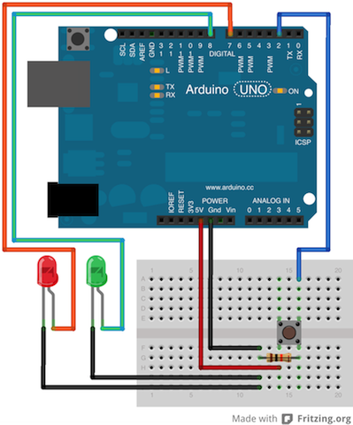

#codingDojuino

This project is a controller for Coding Dojos. 

##What is codingDojuino

A hardware to control when audience can speak whit pilot and co-pilot and control the time of dojo's turn. 

##How it works

The pilot who's programming allows the audience to comment about the solution only if the green light on, when red light on, everybody muted.

##Hardware list:

- Arduino
- pushbutton
- resistor 10k ohm
- 20 red LED | 20 green LED
- Depending of your LED, resistor suppliefile:///Users/bargaorobalo/Documents/Arduino/codingDojuino/codingDojuino.pngs (parallel connection)
- wires
- pack of battery (9v ~ 12v)
- empty crisp fries package or some enclosure

##License

codingDojuino is under [GNU General Public License 3](http://www.gnu.org/licenses/gpl-3.0.html).

###ToDos:
- use a switch button to start/stop the system;
- define: time of rounds = 7min;
